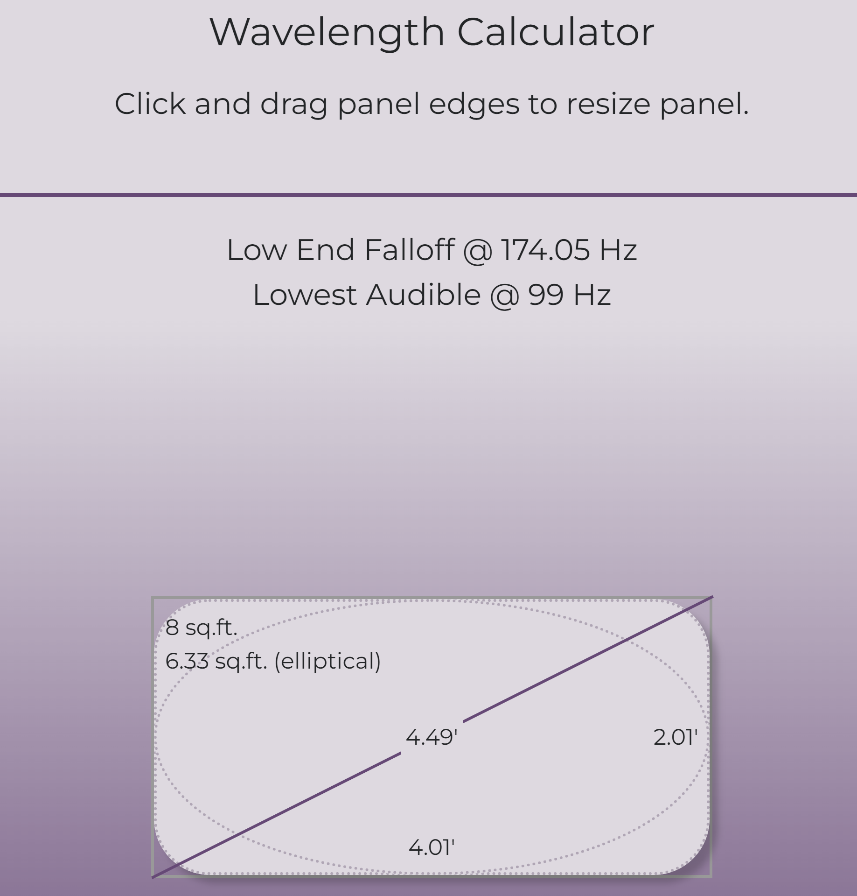
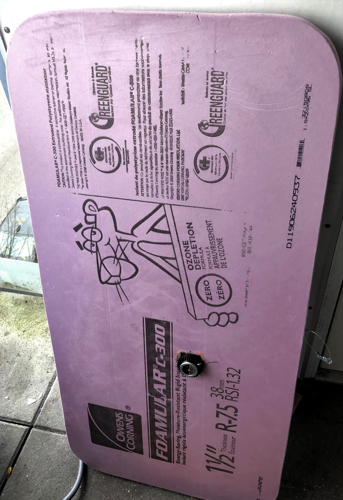

## INTRODUCTION

When I first came across [Tech Ingredients' video](https://www.youtube.com/watch?v=CKIye4RZ-5k&ab_channel=TechIngredients) on distributed mode loudspeakers (DMLs), I was intrigued to try building a set for myself. One of the main draws to the DML design was the way in which these speakers operate in a fundamentally different way to conventional speakers, with sound being generated from oscillations along the large faces of the panels producing sounds, rather than the pistonic motion of a woofer as is used in conventional speakers. 

In his video, Tech Ingredients rigourously tests a variety of materials and shapes of panel, and provides detailed instructions for build recommendations. I mostly follow these instructions in my build, making two speaker panels from 2" thick extruded polystyrene (XPS). I made each panel to be 2' x  4' in size, rounded the corners, sanded the surface, and attached a [Dayton Audio 40W exciter](https://www.amazon.ca/Dayton-Audio-DAEX32EP-4-Thruster-Exciter/dp/B00Q3M8PCY) to each panel at the recommended 2/5ths, 3/5ths location. Find the full Tech Ingredients video and a more detailed summary of my build at the [bottom of the page](https://github.com/levikeay/Project_Site/edit/master/_posts/2022-04-20-DML_build.md#build).

---

## Benefits :
### Value for $

The touted benefits of DML's include improved sound-staging/imaging when used as a stereo set up, and a versatile _almost_ full range speaker with a pleasant, more musical sound than is found in conventional woofer-driver design. Furthermore, they can be constructed from relatively cheap components. After building them myself, I do believe that for the cost of materials they provide a superior sound to what would be acheivable with equivalent funds spent towards woofers, drivers, cabinet enclosures and crossovers that would be needed to build or buy a set of conventional speakers of similar performance in terms of range and frequency response. A breakdown of material costs can be seen below:

| item | cost |
|---|---|
|DAEX32EP-4 Thruster 32mm Exciter 40W 4 Ohm | ~$60/ pair |
|Extruded Polystyrene panel, 8'x2' | ~$40 |

Of course, there are other costs associated with the system that would be needed for any speaker set up, such as speaker wire, an amplifier/ reciever, and a device to play music from. But, a benefit of the DML design is the efficiency of the exciters, which allows for them to be powered by cheaper and smaller Class D amplifiers. I used [this Fosi Audio 2.1 channel amplifier](https://www.amazon.ca/dp/B07K7NJ4QN/ref=sspa_dk_detail_6?psc=1&pd_rd_i=B07K7NJ4QN&pd_rd_w=B74oh&content-id=amzn1.sym.c7dca932-da6a-44fc-af09-cc68d2449b34&pf_rd_p=c7dca932-da6a-44fc-af09-cc68d2449b34&pf_rd_r=12F6TFPH447C5499BGDY&pd_rd_wg=ou4uj&pd_rd_r=08fb28fe-ccaa-4c79-a56a-7f5f6c710efb&s=electronics&sp_csd=d2lkZ2V0TmFtZT1zcF9kZXRhaWw&smid=ATV3LXZ3ZXOW8&spLa=ZW5jcnlwdGVkUXVhbGlmaWVyPUEzSlEzNE1XTVQ4UUxWJmVuY3J5cHRlZElkPUEwNTE2MDE3MTM2N1NLREJFMTJOTCZlbmNyeXB0ZWRBZElkPUEwNTY3NDMxWUMxUEhLSTUzOVQ2JndpZGdldE5hbWU9c3BfZGV0YWlsJmFjdGlvbj1jbGlja1JlZGlyZWN0JmRvTm90TG9nQ2xpY2s9dHJ1ZQ==) that I got form amazon for about $100, after my NAD 712 amplifier lost a channel, and it drives the two panels no problem. See the following section for a note on matching your speakers to an amplifier safely.

### Convenience

A great thing about these speakers, other than their great sound, is their physical flatness. This allows them to hang against a wall and blend in to the room if you are tight on space, as I was in my appartment where I first built them. I think it would be cool to find a way to decorate them without altering the sound properties too much and have them be art and speakers in one. Note, however, that their best acoustic performance will not be attained by having them close to a wall. If possible they should be a few feet away from the wall for optimal acoustics. This is a tradeoff of convenience of space and sound quality that you can decide on for your own use case.

||
|:--:|
|Here the convenient flat hanging of the panels is demonstrated. They are also good to hang laundry on. (Note, this is before I rounded the corners)|

----

## Considerations:
### Choosing an amplifier

One of the aspects of this project that I was the most uncertain about was how to match the speakers to an amplifier. As a quick google will show you, **it is possible to damage your amplifier by running it with a speaker with too low of an impedance**. Most of the exciters out there have a 4 ohm impedance, while most modern amplifiers/recievers are standardized to 8 ohms per channel. This presents a problem for this speaker build, and you have two options to make sure you don't damage your amp:
 1. **Buy an amp which can handle 4 ohm impedances.**

As I recommended above, class D amplifiers are a cheaper and more efficient option to power your speakers. From my research it seems they have had a bad name in the past but that their technology has come a long way and new ones actually sound pretty good. 
Alternatively, older amps such as the NAD 712 sometimes have a switch that allows you to chooose between 8 or 4 ohm output to match the impedance of your speakers.

2. **Buy 2 exciters for each speaker, and connect them in series.**

By connecting two 4 ohm exciters in series, you get an 8 ohm imdedance. This way you can use whatever amplifier you have lying around without worrying about burning it out. Of course the downside is that you will have to spend more on exciters.

### Bass response

One of DML's greatest downsides is a lack of bass output. The lowest frequency that a DML can output is a function of the diagonal corner-to-corner distance of the panel. [This webpage](https://dmlspeakers.com/articles/Does%20Size%20Really%20Matter) provides a nice widget providing a convenient computation of the lowest frequency achievable by a given panel size. As my panels were each built to be 4' x  2', by this calculation their **lowest audible frequency is 99 Hz, with a low end falloff at 174 Hz.**

||
|:--:|
| The calculated low end fall off of my speaker design, thanks to [dmlspeakers.com](https://dmlspeakers.com/articles/Does%20Size%20Really%20Matter)|

This issue is rather easily overcome by including a subwoofer in the system. In picked up a used Velodyne subwoofer from facebook marketplace for about 60$. This sub had an internal crossover, allowing me to set a crossover frequency below which point the sub will provide the output, rather than the speakers. I've played around with the crossover setting, but it is usually set near the predicted 174 Hz drop off point.

### Tuning and EQ

Also recommended in the Tech Ingredients video is to dampen the panels at specified locations. He does a great job of explaining the reasoning behind this in the clip below.

<iframe width="560" height="315" src="https://www.youtube.com/embed/zdkyGDqU7xA" title="YouTube video player" frameborder="0" allow="accelerometer; autoplay; clipboard-write; encrypted-media; gyroscope; picture-in-picture" allowfullscreen></iframe>

I used four ~1 inch diameter washers on each panel in a configuration similar to that recommended by the video in order to dampen the most prevalent harmonics, and obtain a flatter response from the speakers. 

A further step that I found to improve the sound was the implimentation of an EQ. Spotify includes an EQ when listening on a mobile device, find it under settings/playback/EQ. There are many other apps you could use to apply an EQ to your music, but one I found particularily interesting was the [neutralizer EQ app](https://play.google.com/store/apps/details?id=eu.javeo.android.neutralizer&hl=en_CA&gl=US), which helps you build a custom EQ for your system by allowing you to adjust each band as you hear a tone from that band played over broadband noise.

---
## Build 
Here is Tech Ingredient's video detailing the build process, as well as a comparison of frequency response of different panel shapes and materials. The video is very long and detailed, but well worth a watch if you have the patience and are thinking of building these speakers. 

<iframe width="560" height="315" src="https://www.youtube.com/embed/CKIye4RZ-5k" title="YouTube video player" frameborder="0" allow="accelerometer; autoplay; clipboard-write; encrypted-media; gyroscope; picture-in-picture" allowfullscreen></iframe>

---

A summary of the build process that I followed is as follows:

1. Source materials:
  * (2x) Audio exciters from Dayton audio or otherwise
  * (1x) 2'x 8' panel of XPS insulation
  * Fishing line
  * Cotter pins
  * A small amount of epoxy
  * Speakerwire
  * An amplifier which can handle a 4 ohm impedance
  * A subwoofer
2. Cut the panels to size using a exacto knife
  * I made one cut down the middle in order to make them 4x2 feet and maximize surface area from the panel I had.
3. Round the corners using an outline drawn by a round object, and careful exacto knife use.
4. Use sandpaper to round the edges, and remove the gloss from the surface
5. Install cotter pins to hang:
  * drill holes into the edge slight larger than the cotter pins
  * fill with epoxy and insert cotter pins
7. Measure the 2/5ths, 3/5ths point from each edge and attach the exciter to the back of the panel there.
8. Connect to the amplifier using speaker wire

||
|:--:|
|The back of one panel, showing exciter placement and rounded corners|

---

